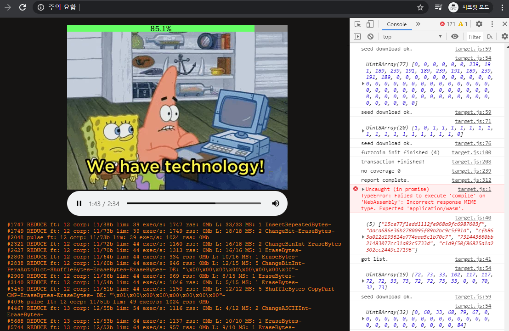
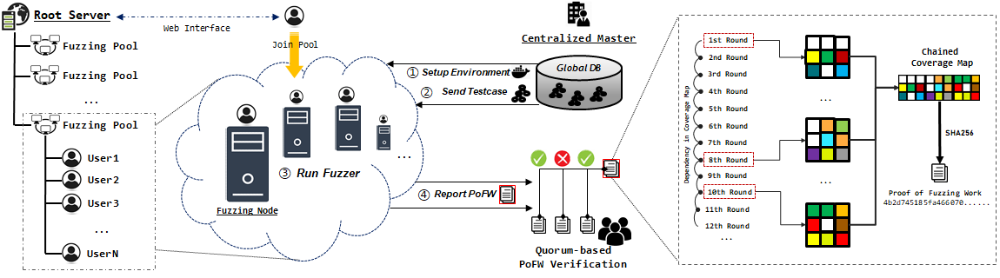

 

#### 무인이동체 선택적 바이너리 퍼징기술 연구 (2021/04/01 ~ 2021/10/31)
국가보안기술연구소 (NSR) 의 위탁연구 프로젝트로서 무인드론과 같은
시스템에 사용되는 Firmware 와 같은 바이너리에 대해서 소스코드가 존재하지
않을때, 또한 바이너리의 전체 구동환경이 존재하지 않는 상황에서도
선택적으로 바이너리의 일부분에 대하여 Coverage Feedback 기반의
Fuzzing 기술을 적용시키는 연구입니다. 
{:width="100%"}

 

#### Web Assembly 기반의 퍼징기술 연구(2021/03/01 ~ 2022/02/28)
웹 어셈블리 기술을 활용하여 OSSFuzz 와 같은 오픈소스 퍼저들을
자바스크립트와 연동하여 웹 브라우저 위에서 실행시킬 수 있도록 하는 연구입니다.
이는 결과적으로 IoT 장비들을 통해서 대규모의 CrowdSourcing 기반 Fuzzing 을
가능하게 할 것으로 기대됩니다. 
{:width="100%"}

 

#### CrowdSourcing 가능한 분산 협업 퍼징플랫폼 연구(on going)
퍼징에 Bitcoin Mining Pool 의 개념을 접합시켜서 공개적으로 누구나
Fuzzing 프로그램을 가동할 수 있는 (채굴 프로그램처럼) Open 인프라를 개발하고, 
이러한 시스템이 보안적으로 안전하면서 효율적으로 운영 될 수 있도록 만드는 연구입니다. 
{:width="100%"}

 
